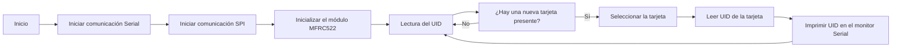
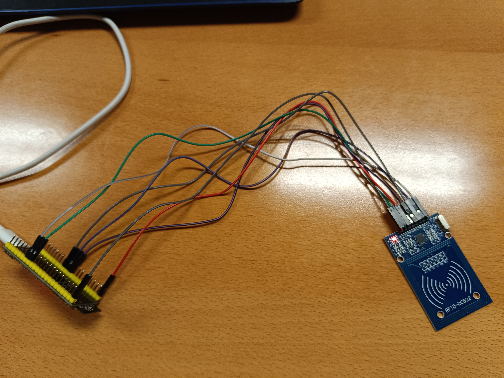

# Practica 6.B: Lectura etiqueta RFID
## Objetivos: 
- El objetivo de la practica es comprender el funcionamiento del bus spi.
- Leer entradas de un lector RFID a partir de NFC.
## Materiales: 
- ESP32-S3
- Placa RFID
- Dispositivo con conexion NFC<br>
**Librerias:**
```ini
    lib_deps =
        MFRC522
```
## Procedimiento: 
**Codigo:**
```cpp
    #include <Arduino.h>

    #include <SPI.h>
    #include <MFRC522.h>
    #define RST_PIN 9 //Pin 9 para el reset del RC522
    #define SS_PIN 10 //Pin 10 para el SS (SDA) del RC522
    MFRC522 mfrc522(SS_PIN, RST_PIN); //Creamos el objeto para el RC522
    void setup() {
    Serial.begin(115200); //Iniciamos la comunicación serial
    SPI.begin(36, 37, 35); //Iniciamos el Bus SPI
    mfrc522.PCD_Init(); // Iniciamos el MFRC522
    Serial.println("Lectura del UID");
    }
    void loop() {
    // Revisamos si hay nuevas tarjetas presentes
    if ( mfrc522.PICC_IsNewCardPresent()) 
    { 
        //Seleccionamos una tarjeta
        if ( mfrc522.PICC_ReadCardSerial()) 
        {
        // Enviamos serialemente su UID
        Serial.print("Card UID:");
        for (byte i = 0; i < mfrc522.uid.size; i++) {
            Serial.print(mfrc522.uid.uidByte[i] < 0x10 ? " 0"
            : " ");
            Serial.print(mfrc522.uid.uidByte[i], HEX); 
        } 
        Serial.println();
        // Terminamos la lectura de la tarjeta actual
        mfrc522.PICC_HaltA(); 
        } 
    } 
    }
```
**Descripción:**<br>
Implementa la funcionalidad de lectura de tarjetas de identificación por radiofrecuencia (RFID) utilizando un módulo MFRC522. El propósito principal es detectar la presencia de tarjetas RFID cercanas y leer sus identificadores únicos (UID).

Para lograr esto, se utilizan las librerías necesarias para la comunicación con el módulo MFRC522 y para la comunicación Serial Peripheral Interface (SPI). Se definen los pines utilizados para el reset del módulo y el pin de selección (SDA o SS) del módulo MFRC522.

En la función ``setup()``, se inicia la comunicación serial para permitir la interacción con el monitor serial y se inicia la comunicación SPI con los pines especificados. Además, se inicializa el módulo MFRC522 para prepararlo para la lectura de tarjetas.

La función ``loop()`` se ejecuta continuamente. En ella, se verifica si hay una nueva tarjeta RFID presente. Si se detecta una tarjeta, se procede a leer su UID utilizando las funciones proporcionadas por la librería MFRC522. Una vez leído el UID de la tarjeta, se imprime en el monitor serial para su visualización.

## Diagrama de flujos: 


## Salida puerto serie: 
```
    Lectura del UID
    Card UID: 08 E4 3E AD
    Card UID: 08 DB 76 CB
```
## Foto montaje: 
 <br>

## Conclusion: 
Permite la detección y lectura de tarjetas RFID utilizando un módulo MFRC522 en combinación con una placa Arduino, proporcionando una manera sencilla de interactuar con dispositivos RFID en proyectos electrónicos.